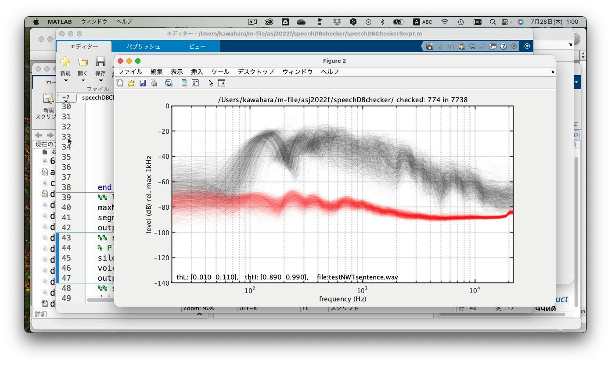

# speechDBchecker
Tools to check signal attributes of sound file(s) 

# Requirement
This uses Audiotoolbox of MATLAB

# Quick start
Run the MATLAB script "speechDBCheckerScrpt.m" using cell mode.

Videos help. I will add subtitles later.

